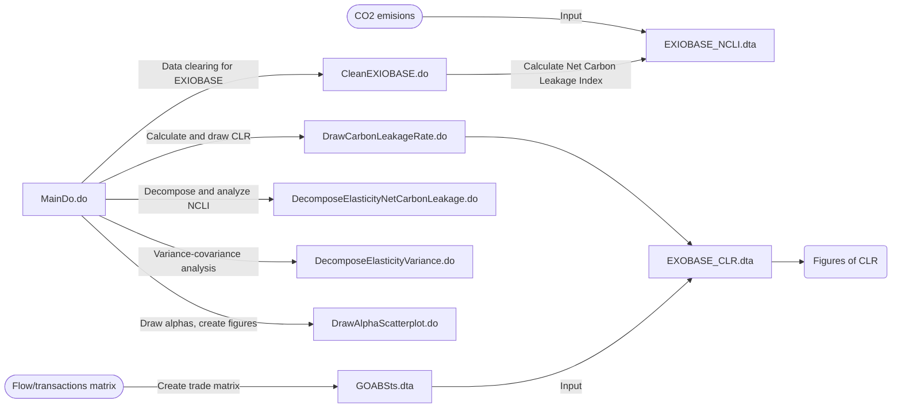

# EITEs

This repository includes codes for "Which Industries Are Prone To Carbon Leakage?". To start, 
1. Clone this repository
2. Get raw data from various sources
   - WIOD 2016 edition
   - WIOD environmental account
   - EXIOBASE
        - Flow/transactions matrix
        - CO2 emissions (production based accounts per sector)
   - Trade elasticity (WIOD 2016)
3. Change current directory in MainDo.do
4. Run MainDo.do

By running these programs, the following data and figures will be output from each do file stored in this repository:

