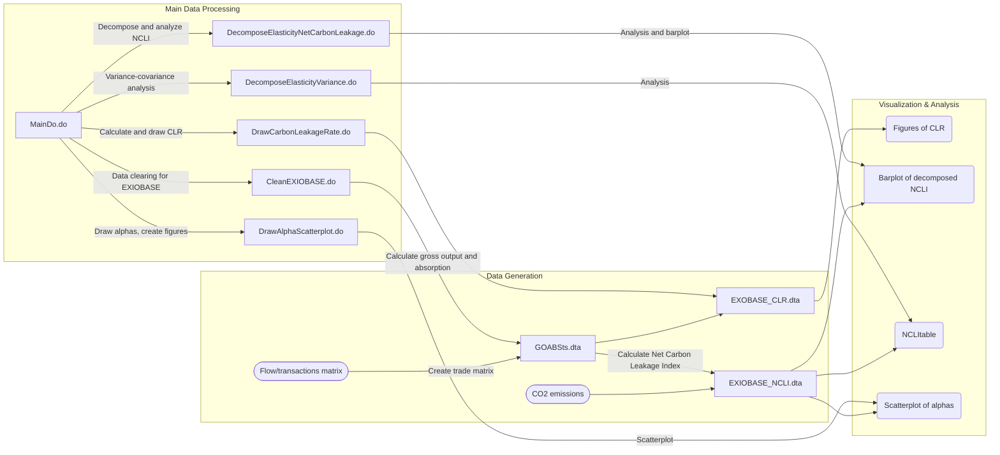

# EITEs

This repository includes codes for "What Industries Are Prone To Carbon Leakage?"

## Summary of the Data Generating Process

To start, 
1. Clone this repository
2. Get raw data from various sources
   - [World Input-Output Database](https://www.rug.nl/ggdc/valuechain/wiod/wiod-2016-release)
      - WIOD 2016 edition
      - WIOD environmental account
   - [EXIOBASE](https://www.exiobase.eu/)
      - Flow/transactions matrix
      - CO2 emissions (production based accounts per sector)
   - [Trade elasticity (WIOD 2016)](https://sites.google.com/view/product-level-trade-elasticity)
      - [Dataset WIOD (rev 2016) classification](https://drive.google.com/file/d/1bWH784Rm_vbMAMt5RDx28vGacjVWFMqH/view?usp=sharing)
3. Change current directory in MainDo.do
4. Run MainDo.do

The following data and figures are output from each do file stored in this repository.

##  Details of the Data Generating Process
Here we show how to create outputs using EXIOBASE and Stata codes, 
but you can create WIOD-version outputs by using the corresponding WIOD-version do files.

You can also replicate in R by running [R code](https://github.com/yutawatabe/EITEs/tree/main/do/inR).

### [Clean EXIOBASE.do](https://github.com/yutawatabe/EITEs/blob/main/do/EXIOBASE/CleanEXIOBASE.do)
- **Inputs**   
1. [CountryIndustryCode.xlxs](https://github.com/yutawatabe/EITEs/tree/main/raw/EXIOBASE)  
     - "EXOBASE_to_WIOD_indscode" can create based on ...
     - [WIOD-EXIO_concordances.xlxs](https://ntnu.app.box.com/v/EXIOBASEconcordances/folder/47855472210): Industrial code correspondence table. Keep in mind that the industrial codes in the concordances table don't match one-to-one with the industrial codes of EXIOBASE and WIOD that you download and use.
     - [WIOD](https://www.rug.nl/ggdc/valuechain/wiod/wiod-2016-release)

2. [EXIOBASE](https://www.exiobase.eu/)  
   - [Z.txt](https://github.com/yutawatabe/EITEs/tree/main/raw/EXIOBASE/IOT_YYYY_ixi): Flow/transactions matrix.
   - [D_pba.txt](https://github.com/yutawatabe/EITEs/tree/main/raw/EXIOBASE/IOT_YYYY_ixi/satellite): Production based CO2 emissions per sector.
    
3. [Product-Level Trade Elasticity](https://sites.google.com/view/product-level-trade-elasticity)
   - [Dataset WIOD (rev 2016) classification](https://drive.google.com/file/d/1bWH784Rm_vbMAMt5RDx28vGacjVWFMqH/view?usp=sharing)

 

- **Outputs**
1. [GOABSts_YYYY.dta](https://github.com/yutawatabe/EITEs/tree/main/temp/EXIOBASE) created by "EXIOBASE > Z.txt"
   - export: Export from origin to destination.
   - GO: Gross output in origin.
   - GOw: World gross output.
   - GOshare: Relative share of output in origin in sector s, compared to world output in sector s.
   - ABS: Absorption in origin.
   - t: Export/gross output in origin.
   - s: Export/absorption.   
 [GOABSts.dta](https://github.com/yutawatabe/EITEs/tree/main/temp/EXIOBASE): Combines data from all years.  
 [GOABS.dta](https://github.com/yutawatabe/EITEs/tree/main/temp/EXIOBASE): Take gross output and absorption from GOABSts.dta.  
  
2. [Energy_YYYY.dta](https://github.com/yutawatabe/EITEs/tree/main/temp/EXIOBASE) created by "EXIOBASE > Z.txt".
   - EnergyExp: Energy input in origin    
 [Energy.dta](https://github.com/yutawatabe/EITEs/tree/main/temp/EXIOBASE): Combines data from all years. 

3. [CO2_YYYY.dta](https://github.com/yutawatabe/EITEs/tree/main/temp/EXIOBASE) created by "EXIOBASE > satellite > D_pba.txt".  
 [CO2.dta](https://github.com/yutawatabe/EITEs/tree/main/temp/EXIOBASE): Combines data from all years.

4. [countrydata.dta](https://github.com/yutawatabe/EITEs/tree/main/temp/EXIOBASE) created by "GOABS.dta", "Energy.dta", and "CO2.dta".
   - alpha: CO2 emission share in origin in sector s. 
   - beta: Energy cost share in origin in energy sectors.

5. [alphaw.dta](https://github.com/yutawatabe/EITEs/tree/main/temp/EXIOBASE) created by "countrydata.dta".
    
6. [GOABStsalpha.dta](https://github.com/yutawatabe/EITEs/tree/main/temp/EXIOBASE) created by "GOABSts.dta".
   - alphatilde

7. [EXIOBASE_NCLI.dta](https://github.com/yutawatabe/EITEs/blob/main/results/EXIOBASE/EXIOBASE_NCLI.dta) created by "GOABStsalpha.dta" and "Dataset WIOD (rev 2016) classification".
   - NCLI: Net Carbon Leakage Index.
   - NCLIft: Net Carbon Leakage Index in free trade economy.
   - GCLI
   - GCLIft
   - All variables created from output 1-6, and their logarithms.

 

### [CarbonLeakageRate.do](https://github.com/yutawatabe/EITEs/blob/main/do/EXIOBASE/CarbonLeakageRate.do)
- **Inputs**   
1. [GOABSts.dta](https://github.com/yutawatabe/EITEs/tree/main/temp/EXIOBASE)  
2. [EXIOBASE_NCLI.dta](https://github.com/yutawatabe/EITEs/blob/main/results/EXIOBASE/EXIOBASE_NCLI.dta)

 

- **Outputs**
1. [EXIOBASE_CLR.dta](https://github.com/yutawatabe/EITEs/blob/main/results/EXIOBASE/EXIOBASE_CLR.dta)
   - CLR: Carbon Leakage Rate.
   - CLRft: Carbon Leakage Rate in free trade economy.
  
2. [carbonleakagerate1995scatter.png](https://github.com/yutawatabe/EITEs/blob/main/results/EXIOBASE/Figures/carbonleakagerate1995scatter.png):
Scatter plot of CLR vs CLRft by CBAMs (N-Fertiliser, P- and other Fertiliser, Cement, Iron and Steel, Aluminum) and Apparel.

3. [carbonleakagerate1995.png](https://github.com/yutawatabe/EITEs/blob/main/results/EXIOBASE/Figures/carbonleakageratefreetrade1995.png):
Bar blot of CLR by CBAMs.

4. [carbonleakageratefreetrade1995.png](https://github.com/yutawatabe/EITEs/tree/main/temp/EXIOBASE):
Bar blot of CLR in free trade economy by CBAMs.

 

### [DrawAlphaScatterplot.do](https://github.com/yutawatabe/EITEs/blob/main/do/DrawAlphaScatterplot.do)
- **Inputs**   
1. [EXIOBASE_NCLI.dta](https://github.com/yutawatabe/EITEs/blob/main/results/EXIOBASE/EXIOBASE_NCLI.dta)

 

- **Outputs**
1. [sctplot_alphatilde_vs_alphaworld.png](https://github.com/yutawatabe/EITEs/blob/main/results/EXIOBASE/Figures/sctplot_alphatilde_vs_alphaworld.png):
Scatter plot of alphatilde vs alphaworld by country (CHN, IND, MEX, USA, JPN, DEU, FRA, GBR).

2. [sctplot_alphatilde_vs_alpha.png](https://github.com/yutawatabe/EITEs/blob/main/results/EXIOBASE/Figures/sctplot_alphatilde_vs_alpha.png):
Scatter plot of alphatilde vs alpha by country.

3. [sctplot_alphaw_vs_alpha.png](https://github.com/yutawatabe/EITEs/blob/main/results/EXIOBASE/Figures/sctplot_alphaw_vs_alpha.png):
Scatter plot of alphaworld vs alpha by country.

4. [sctplot_netalphaw_vs_netalphatilde.png](https://github.com/yutawatabe/EITEs/blob/main/results/EXIOBASE/Figures/sctplot_netalphaw_vs_netalphatilde.png):
Scatter plot of (alphatilde - alpha) vs (alphaw - alpha) by country.

5. [sctplot_alphas_vs_alphasft.png](https://github.com/yutawatabe/EITEs/blob/main/results/EXIOBASE/Figures/sctplot_alphas_vs_alphasft.png):
Scatter plot of (alphatilde - alpha)/alphaw vs (alphaw - alpha)/alphaw by country.

6. [alpha_vs_alphatilde_adjbyalphaw](https://github.com/yutawatabe/EITEs/blob/main/results/EXIOBASE/Figures/alpha_vs_alphatilde_adjbyalphaw.png):
Scatter plot of alpha/alphaw vs alphatilde/alphaw by CBAMs, and EU, CHN and IND.

7. [netalpha_vs_netalphatilde_adjbyalphaw_byinds.png](https://github.com/yutawatabe/EITEs/blob/main/results/EXIOBASE/Figures/netalpha_vs_netalphatilde_adjbyalphaw_byinds.png):
Scatter plot of (alphatilde - alpha)/alphaw vs (alphaw - alpha)/alphaw by CBAMs, and EU, CHN and IND.

8. [netalpha_vs_netalphatilde_adjbyalphaw.png](https://github.com/yutawatabe/EITEs/blob/main/results/EXIOBASE/Figures/netalpha_vs_netalphatilde_adjbyalphaw.png):
Scatter plot of (alphatilde - alpha)/alphaw vs (alphaw - alpha)/alphaw by country, and CBAMs and EITEs.

9. [netalpha_vs_netalphaw.png](https://github.com/yutawatabe/EITEs/blob/main/results/EXIOBASE/Figures/netalpha_vs_netalphaw.png):
Scatter plot of (alphatilde - alpha) vs (alphaw - alpha) by country, and CBAMs and EITEs.

 

### [DecomposeElasticityNetCarbonLeakage.do](https://github.com/yutawatabe/EITEs/blob/main/do/DecomposeElasticityNetCarbonLeakage.do)
- **Inputs**   
1. [EXIOBASE_NCLI.dta](https://github.com/yutawatabe/EITEs/blob/main/results/EXIOBASE/EXIOBASE_NCLI.dta)

 

- **Outputs**
1. [barplot_decomp_chgemission.png](https://github.com/yutawatabe/EITEs/blob/main/results/EXIOBASE/Figures/barplot_decomp_chgemission.png):
Bar plot of decomposed alphas by country.

2. [regression_result.xlsx](https://github.com/yutawatabe/EITEs/tree/main/results/EXIOBASE/Tables):
Results of regression NCLI on alpha, t, s by year.

 

### [DecomposeElasticityVariance.do](https://github.com/yutawatabe/EITEs/blob/main/do/DecomposeElasticityVariance.do)
- **Inputs**   
1. [EXIOBASE_NCLI.dta](https://github.com/yutawatabe/EITEs/blob/main/results/EXIOBASE/EXIOBASE_NCLI.dta)

 

- **Outputs**
1. Variance-Covariance Analysis

2. [NCLItable.xlsx](https://github.com/yutawatabe/EITEs/blob/main/results/EXIOBASE/Tables/NCLItable.xlsx):
Table of NCLI, NCLIft, GCLI, GCLIft.

