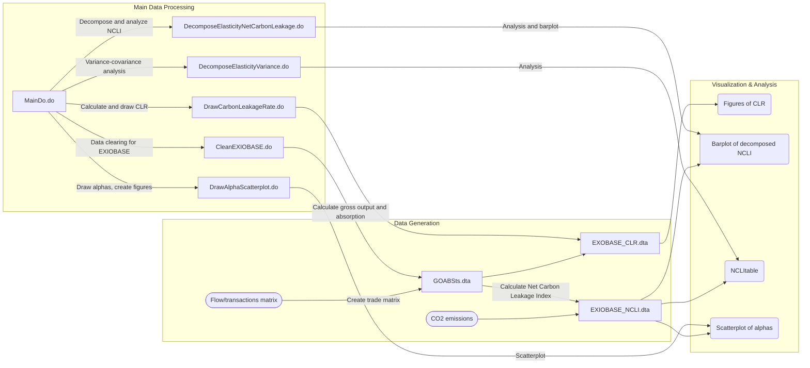

# EITEs

This repository includes codes for "What Industries Are Prone To Carbon Leakage?"

## Summary of the Data Generating Process

To start, 
1. Clone this repository
2. Get raw data from various sources
   - [World Input-Output Database](https://www.rug.nl/ggdc/valuechain/wiod/wiod-2016-release)
      - WIOD 2016 edition
      - WIOD environmental account
   - [EXIOBASE](https://www.exiobase.eu/)
      - Flow/transactions matrix
      - CO2 emissions (production based accounts per sector)
   - [Trade elasticity (WIOD 2016)](https://sites.google.com/view/product-level-trade-elasticity)
3. Change current directory in MainDo.do
4. Run MainDo.do

The following data and figures are output from each do file stored in this repository.

##  Details of Raw Data

* [World Input-Output Database](https://www.rug.nl/ggdc/valuechain/wiod/wiod-2016-release)
  *  WIOD 2016 release: World Input-output tables
  *  Environment Accounts: Data on energy use and CO2 emissions by industry and country
* [EXIOBASE](https://www.exiobase.eu/)
  * IOT_YYYY_ixi.zip
    * Z.txt: Flow/transactions matrix
    * satellite > D_pba.txt: Production based CO2 emissions per sector
* [Product-Level Trade Elasticity](https://sites.google.com/view/product-level-trade-elasticity)
